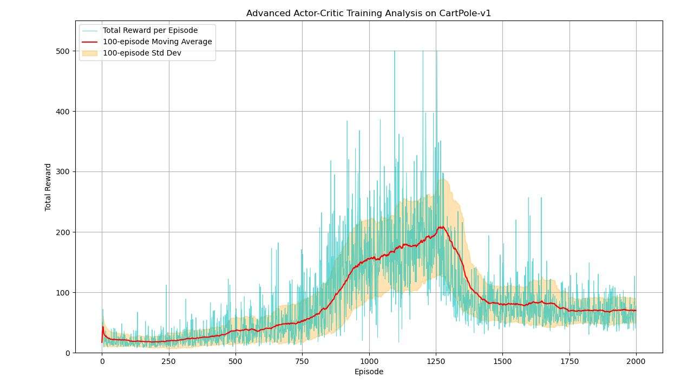

# Cartpole Balancing

### 🎯 Problem Definition: CartPole Balancing

**Objective:** Prevent a pole attached to a cart from falling over.

- **State (s):** `[cart_position, cart_velocity, pole_angle, pole_angular_velocity]`
- **Action (a):** `0` (push left) or `1` (push right)
- **Reward:** `+1` for every timestep the pole remains upright
- **Termination:** Pole angle > ±12° or cart moves > ±2.4 units from center

---

# Prototype

---

### 🧮 Mathematical Setup (Prototype)

We'll use **linear function approximation** for both actor and critic.

#### 1. **Feature Engineering**

We'll use polynomial features to capture interactions, feature vector: $$\phi(s) ∈ R^d$$

#### 2. **Actor: Parameterized Policy**

We use the **softmax policy**:

$$
\pi(a|s; \theta) = \frac{e^{\phi(s)^T \theta_a}}{\sum_{b} e^{\phi(s)^T \theta_b}}
$$

Where $$\theta ∈ R^{\(d×2\)}$$ are our actor parameters.

#### 3. **Critic: State-Value Function**

Linear function approximation:

$$
V(s; w) = \phi(s)^T w
$$

Where $$w ∈ R^d$$ are our critic parameters.

---

### 🔄 Learning Algorithm: One-Step Actor-Critic

**Update Rules:**

1. **TD Error:**

$$
\delta_t = r_{t+1} + \gamma V(s_{t+1}; w) - V(s_t; w)
$$

2. **Critic Update (Semi-gradient TD(0)):**

$$
w \leftarrow w + \beta \delta_t \nabla_w V(s_t; w) = w + \beta \delta_t \phi(s_t)
$$

3. **Actor Update (Policy Gradient):**

$$
\theta \leftarrow \theta + \alpha \delta_t \nabla_\theta \log \pi(a_t|s_t; \theta)
$$

Where the **policy gradient** for softmax is:

$$
\nabla_\theta \log \pi(a|s; \theta) = \phi(s)(\mathbf{1}_{a} - \pi(a|s; \theta))
$$

Here $\mathbf{1}_a$ is a one-hot vector for action $a$.

---

### 📊 Training Performance

The graph shows three distinct phases:

1.  **The Ascent (Episodes 0-750):** The agent starts with no knowledge. The moving average reward slowly and noisily climbs as both the actor and critic begin to form a useful model of the environment.
2.  **The Peak (Episodes 750-1250):** The agent reaches a point where it can solve the task, achieving the maximum score, but incredibly unstable.
3.  **The Collapse (Episodes 1250+):** The moving average plummets.

This happens because the agent seems to "forget" everything it learned a series of updates, driven by the inherent instability, pushes the policy or value function parameters into a bad region from which it is difficult to recover.
