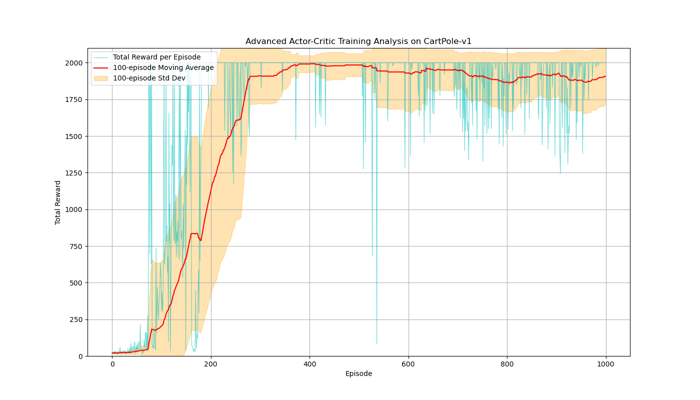
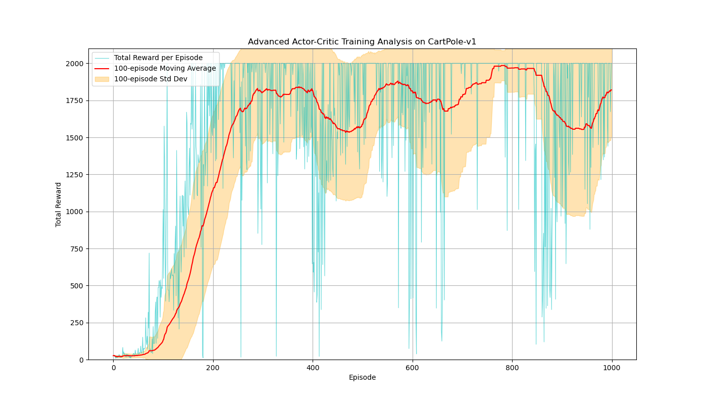

# Enhancements:

## A2C (Advantage Actor-Critic)

### The Problem with 1-Step Actor-Critic (Recap)

In the Standard Actor-Critic method:

$$
\delta_t = A_t^{(1)} = \underbrace{r_{t+1} + \gamma V(s_{t+1}; w)}_{\text{1-step Target}} - V(s_t; w) = G_t^{(1)} - V(s_t; w)
$$

This target is based on only a single real reward, $r_{t+1}$, and then immediately bootstraps from the very next state, $V(s_{t+1}; w)$. This makes it a very noisy and high-variance estimate of the true value of being in state $s_t$.

### The Core Idea of N-Step A2C: Look Deeper

Central idea: To get a more accurate and lower-variance estimate of a state's value, we should incorporate more real rewards from the future before we bootstrap.

### The Mathematical Foundation

#### 1. The N-Step Return (The Critic's Target)

We define the **N-step return**, denoted $G_t^{(n)}$:

$$
G_t^{(n)} \equiv r_{t+1} + \gamma r_{t+2} + \gamma^2 r_{t+3} + \dots + \gamma^{n-1}r_{t+n} + \gamma^n V(s_{t+n}; w)
$$

Or:

$$
G_t^{(n)} = \sum_{k=0}^{n-1} \gamma^k r_{t+k+1} + \gamma^n V(s_{t+n}; w)
$$

If the episode terminates before N steps are completed (at step $T < t+n$), the sum only goes up to the final reward.

#### 2. The N-Step Advantage (The Actor's Critique)

The TD error $\delta_t$ was a noisy estimate of the **advantage** of taking action $a_t$. We now replace it with a much more stable N-step advantage estimate, $A_t^{(n)}$, which serves as a baseline:

$$
A_t^{(n)} = G_t^{(n)} - V(s_t; w)
$$

By incorporating N real rewards, $G_t^{(n)}$ is a much more stable target than the 1-step target. Consequently, $A_t^{(n)}$ is a **lower-variance** critique for the actor, leading to more stable policy updates.

#### 3. The New Update Rules

**a) Critic Update**

The critic's job is to make its value estimate, $V(s_t; w)$, as close as possible to the more accurate N-step return, $G_t^{(n)}$. We express this using:

$$
L_V = \left( G_t^{(n)} - V(s_t; w) \right)^2
$$

The gradient update:

$$
w \leftarrow w + \beta \underbrace{(G_t^{(n)} - V(s_t; w))}_{A_t^{(n)}} \nabla_w V(s_t; w)
$$

**b) Actor Update**

The actor's job is to increase the probability of actions that led to a positive advantage and decrease the probability for actions that led to a negative one. This is the policy gradient theorem:

$$
L_\pi = -A_t^{(n)} \log \pi(a_t | s_t; \theta)
$$

**Note the negative sign:** Optimizers _minimize_ loss. We want to _maximize_ the log-probability of good actions (where $A_t^{(n)} > 0$), so we minimize its negative. When calculating the gradient for this loss, the advantage $A_t^{(n)}$ is treated as a constant.

$$
\theta \leftarrow \theta + \alpha \underbrace{(G_t^{(n)} - V(s_t; w))}_{A_t^{(n)}} \nabla_\theta \log \pi(a_t|s_t; \theta)
$$

### 📊 Training Performance

**Observation**: The plot is more stable than the previous version. There is also a trade-off between the bias (N) and the variance.
