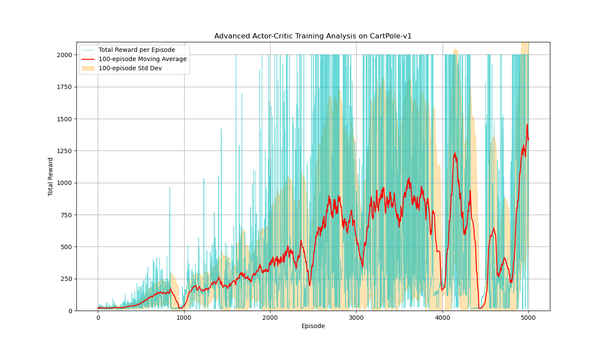

# Enhancements:

## Neural Network

Replace two separate linear models, $V(s;w)$ and $\pi(a|s;\theta)$, with a single, unified neural network. This network will have a shared "body" that learns a useful feature representation of the state, and two separate "heads" that use this representation to perform the tasks of the actor and the critic.

Let the entire neural network be parameterized by a single set of weights, $\psi$.

#### 1. The Network Architecture

1.  **Input:** The raw state vector $s \in \mathbb{R}^4$.
2.  **Shared Body:** A set of hidden layers (e.g., one or more fully connected layers with ReLU activation) parameterized by $\psi_{shared}$. This body learns to transform the raw state $s$ into a high-level feature vector $h(s)$.

$$
h(s) = \text{Body}(s; \psi_{shared})
$$

3.  **Two Heads:**

- **Critic Head (Value Head):** A single linear output layer (Weighted sum) that takes the feature vector $h(s)$ and produces a scalar state-value estimate.
    
$$
V(s; \psi) = \text{CriticHead}(h(s); \psi_{critic})
$$

- **Actor Head (Policy Head):** A linear output layer (Weighted sum) that takes $h(s)$ and produces a logit for each action.
    
$$
\vec{l}(s; \psi) = \text{ActorHead}(h(s); \psi_{actor})
$$

$$
\pi(\cdot|s; \psi) = \text{Softmax}(\vec{l}(s; \psi))
$$

The total set of network parameters is $\psi = \{\psi_{shared}, \psi_{critic}, \psi_{actor}\}$.

#### 2. The Combined Loss Function

Since we have a single network performing two tasks, we train it by minimizing a **combined loss function**. This loss is a weighted sum of the critic's loss, the actor's loss, and an optional entropy bonus.

$$
L(\psi) = c_V L_V(\psi) + L_\pi(\psi) - c_S L_S(\psi)
$$

**a) Critic Loss ($L_V$):**

$$
L_V(\psi) = (G_t^{(n)} - V(s_t; \psi))^2
$$

**b) Actor Loss ($L_\pi$):**

$$
L_\pi(\psi) = -A_t^{(n)} \log \pi(a_t|s_t; \psi)
$$

**Note:** When calculating this loss, the advantage term $A_t^{(n)} = G_t^{(n)} - V(s_t; \psi)$ is treated as a **constant**.

**c) Entropy Bonus ($L_S$):** Entropy is a measure of a policy's randomness. A higher entropy means the policy is more exploratory. We add an entropy bonus to the loss function to encourage exploration and prevent the policy from collapsing into a deterministic (and possibly suboptimal) one too early. We want to _maximize_ entropy, so we _subtract_ its value from the loss.

$$
L_S(\psi) = S(\pi(\cdot|s_t; \psi)) = - \sum_{a} \pi(a|s_t; \psi) \log \pi(a|s_t; \psi)
$$

The coefficient $c_S$ controls the strength of the exploration incentive.

### 📊 Training Performance

**Observations:** The performance is highly unstable and being outstripped by the previous version (Tile Coding instead of Neural Network)

### Why Performance Dropped?

#### 1. The Combined and Harder Learning Problem

- **Tile Coding Agent:** The agent's only task was to learn a simple linear mapping on top of these excellent features.

$$
V(s) \approx \sum_{i \in \phi(s)} w_i
$$

  The learning signal from an update only had to adjust a few weights $w_i$, a relatively simple credit assignment problem.

- **Neural Network Agent:** This agent must learn the feature extractor _and_ the value/policy functions simultaneously.

$$
V(s) \approx \text{CriticHead}(\underbrace{\text{Body}(s; \psi_{shared})}_{\text{Must be learned}}; \psi_{critic})
$$

  This means a single update based on an advantage $A_t$ creates a dense, complex gradient that can subtly alter the _entire feature representation_ for all states.

#### 2. The Loss of a Favorable Inductive Bias

An "inductive bias" is a set of assumptions a model makes to generalize from finite data.

- **Tile Coding's Bias is Locality:** When a state $s$ activates a set of tiles, a slightly different state $s'$ will activate many of the same tiles. This structure provides smooth, local generalization. For physical control problems like CartPole, **this is an extremely powerful and correct assumption.**

- **The MLP's Bias is Weak:** It has a very weak inductive bias. It does not inherently assume that nearby points should have similar values. It must learn this property from the data, which requires many more samples and careful tuning. The agent is essentially re-discovering the principles of locality that tile coding provides by default. Therefore, it's much harder for MLP to solve this problem.

### When Will the Neural Network Outstrip Tile Coding?

#### 1. **High-Dimensional State Spaces (The Curse of Dimensionality)**

Let $d$ be the number of dimensions and $b$ be the number of bins per dimension. The number of tiles in a single tiling is $b^d$.

- **CartPole:** $d=4, b=10 \implies 10^4$ tiles.
- **Atari Games (from pixels):** A simple `84x84x4` state has $d \approx 28,000$. Tile coding is practically impossible.
- **Neural networks scale polynomially.** The number of weights in the first layer scales linearly with $d$.

#### 2. **Complex, Non-Local Feature Interactions**

Tile coding assumes locality. It cannot easily represent relationships between distant points in the state space.

- **Example:** In a strategy game, the strategic value of a unit in the top-left corner might depend entirely on the presence of another unit in the bottom-right. Tile coding could never learn this interaction.
- Deep neural networks excel at learning these hierarchical and non-local features through successive layers of abstraction.

#### 3. **Raw Sensory Inputs (e.g., Vision, Audio)**

We can't manually design a tile-coding scheme for raw pixels from a camera. For insatnce, specialized architectures like **Convolutional Neural Networks (CNNs)** provide the correct inductive bias (spatial invariance, hierarchical features) for image data. A deep RL agent using a CNN can learn to play a video game directly from the screen's pixels—a feat entirely beyond the reach of tile coding.
