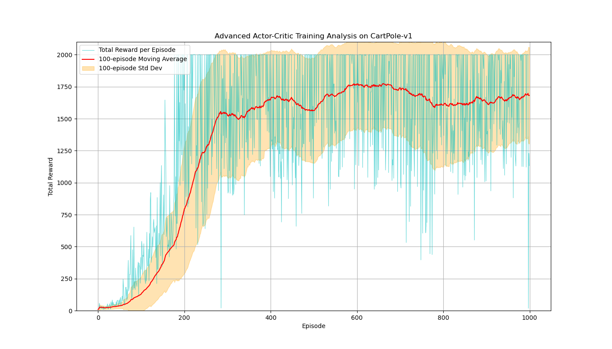

# Enhancements:

## Tile Coding

### 1. State Normalization

$$
s_{\text{norm}}^{(i)} = \frac{s_{\text{raw}}^{(i)} - \text{low}^{(i)}}{\text{high}^{(i)} - \text{low}^{(i)}}
$$

This ensures that each dimension of the state contributes equally to the tiling structure, regardless of its original physical scale (e.g., position vs. angular velocity).

### 2. Tile Coding Feature Generation

Generate a sparse, binary feature vector $\phi(s)$ from a continuous state $s$. Instead of a dense vector, $\phi(s)$ is now represented by a list of active tile indices. Let `m` be the number of tilings. The feature vector $\phi(s)$ is a set of `m` active indices:

$$
\phi(s) = \{ \text{index}_0, \text{index}_1, \dots, \text{index}_{m-1} \}
$$

For each tiling $j \in \{0, 1, \dots, m-1\}$, it is calculated by:

#### **1. State Quantization**

First, each component $s_{\text{norm}}^{(i)}$ of the state vector is scaled and quantized into an integer vector $q \in \mathbb{Z}^D$.

$$
q^{(i)} = \lfloor m \cdot s_{\text{norm}}^{(i)} \rfloor \quad \text{for } i \in \{0, 1, \dots, D-1\}
$$

#### **2. Asymmetric Coordinate Calculation**

Next, for each dimension $i$ of the quantized vector $q$, an offset is applied that depends on both the dimension index $i$ and the tiling index $j$. This creates the shifted grids. The coordinate for dimension $i$ in tiling $j$, denoted $c_j^{(i)}$, is calculated as:

$$
c_j^{(i)} =
\begin{cases}
    \lfloor (q^{(i)} + i + 2j) / m \rfloor & \text{if } q^{(i)} \ge 0 \\
    \lfloor (q^{(i)} - i - 2j) / m \rfloor & \text{if } q^{(i)} < 0
\end{cases}
$$

#### **3. Assembling the Full Coordinate Tuple**

The final coordinate for tiling $j$ is a tuple $C_j$ that includes the tiling index itself, the calculated coordinates for each dimension, and any optional discrete integer features, such as actions.

$$
C_j(s,a) = (j, c_j^{(0)}, c_j^{(1)}, \dots, c_j^{(D-1)}, a, \dots)
$$

#### **4. Hashing to a Final Index**

Finally, the `IHT` structure takes the complete coordinate tuple $C_j$ and maps it to a single integer index within a fixed memory size $N$. Let $H$ be the hashing function. The final index for tiling $j$ is:

$$
\text{index}_j = H(C_j) \pmod N
$$

The reason that we need to introduce hashing is because of **the curse of dimensionality**.

For instance, in this problem, we have 4 state dimensions. Supposed that we use 10 tiles for each tilings, 8 tilings. Then, the number of possible $C_j$ would be $8 \cdot 10^4 = 80000$. Therefore, we need to use hashing to reduce this number down (e.g. 4096).

### 3. Integration with the Actor-Critic Model

#### **Critic: State-Value Function**

The value is no longer a dot product. It's the **sum** of the weights corresponding to the active tiles.

$$
V(s; w) = \sum_{i \in \phi(s)} w_i
$$

#### **Actor: Policy Preferences**

Similarly, the preference (or logit) for taking an action `a` is the sum of the corresponding actor weights for the active tiles.

$$
H(s, a; \theta) = \sum_{i \in \phi(s)} \theta_{i,a}
$$

The softmax policy $π(a|s; θ)$ is then computed from these preferences as before.

#### **Gradient Updates**

The gradient $∇V(s;w)$ is now a sparse vector with `1`s only at the active tile indices. This simplifies the update rules significantly. For every active tile index `i` in the feature set $\phi(s_t)$:

- **Critic Update:**

$$
w_i \leftarrow w_i + \beta \delta_t
$$

- **Actor Update:**

$$
\theta_{i, a_t} \leftarrow \theta_{i, a_t} + \alpha \delta_t (1 - \pi(a_t|s_t; \theta))
$$

### 📊 Training Performance

**Observation**: Although the variance is substantially higher, the total reward surpassed the prototype version significantly, and the stability is significantly increased (No more steady declines after peaking).

### Why it performed better than the standard version (No Tile Coding)?

#### 1. Global, Correlated Generalization (Polynomial Features)

The value of a state is a dot product:

$$
V(s; w) = \phi(s)^T w = \sum_{i} \phi_i(s) w_i
$$

The key issue is that the features ($1, x, \theta, x \cdot \theta, ...$) are **global**. If a feature like $x \cdot \theta$ is non-zero, it will influence large regions of the state space. When we perform an update:

$$
w_i \leftarrow w_i + \beta \delta_t \phi_i(s_t)
$$

Just like we are changing a weight $w_i$ that affects the value estimate for **many other unrelated states**. If the agent receives a single large, noisy $δ_t$ (a bad critique), this update can **interference** and corrupt the value function across the board.

In short, the dense feature vector, once being updated, affects a large area, instead of small neighbor areas.

#### 2. Local, Controlled Generalization (Tile Coding)

The value of a state is a sum over a small, fixed number of active weights:

$$
V(s; w) = \sum_{i \in \phi(s)} w_i
$$

When we perform an update, we only modify the weights of the currently active tiles:

$$
\text{For each } i \in \phi(s_t): \quad w_i \leftarrow w_i + \beta \delta_t
$$

This generalization is **local**. An update at state $s$ only affects states that share at least one of its active tiles, it doesn't corrupt the entire value function. This is why the learning process in this version is so much more robust and does not collapse.

| Metric               | Graph 1 (Polynomial Features)                                                                                        | Graph 2 (Tile Coding)                                                                                                                | Winner          |
| :------------------- | :------------------------------------------------------------------------------------------------------------------- | :----------------------------------------------------------------------------------------------------------------------------------- | :-------------- |
| **Learning Speed**   | Very slow. Takes ~750 episodes to show significant progress.                                                         | Rapid. Shows strong, immediate progress from the very first episodes.                                                                | **Tile Coding** |
| **Peak Performance** | The moving average peaks at a reward of ~210.                                                                        | The moving average consistently exceeds 400, approaching the maximum of 500.                                                         | **Tile Coding** |
| **Stability**        | **Unstable learning process.** After peaking, the agent's performance catastrophically collapses and never recovers. | **Stable learning process.** The agent learns and maintains a high level of performance without collapsing.                          | **Tile Coding** |
| **Variance**         | Moderate variance during learning, followed by low variance at a suboptimal level after the collapse.                | **High performance variance.** Even with a high average reward, individual episode rewards fluctuate wildly (e.g., from 150 to 500). | N/A             |
